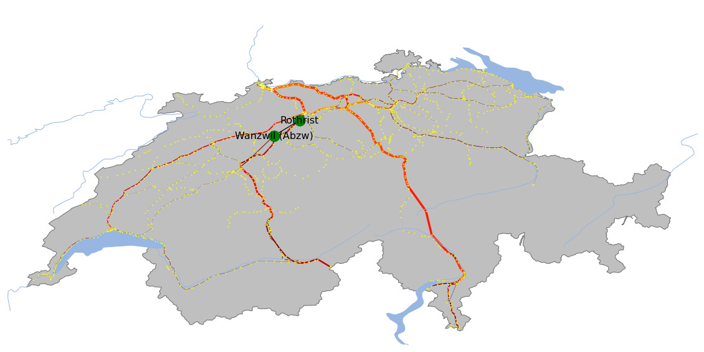

 

<h1> Network and Graph Analysis of Swiss Rail Traffic: SBB Dataset Visualization</h1>
<h3 align="center">CAS, FHNW Brugg</h3>
<h3 align="center">Gaph Analysis</h3>
<h4 align="center">Claudio Schmidli</h4>
<h4 align="center">26.06.2021</h4>

## Overview:
This project visualizes the utilization of routes in the Swiss Federal Railways (SBB) network for the last three years. The dataset was fetched from the SBB API, which provides open data via data.sbb.ch. The project serves as part of the "Graph Analysis" module in the CAS Data Science program at FHNW (https://www.fhnw.ch/de/weiterbildung/informatik/cas-data-science). This was my very first project among all my data science projects and laid the foundation for my understanding of data analysis in the context of transportation networks.

## Project Tasks:
- **Network Visualization:**  
  Visualize the Swiss Federal Railways (SBB) network, showcasing the utilization of different routes.

- **Key Traffic Nodes:**  
  Identify and visualize the most important traffic nodes within the network.

- **Comparing Freight and Passenger Traffic:**  
  Compare the traffic patterns for freight and passenger transport over the last three years, taking into account the impacts of the COVID-19 pandemic.

- **Shortest and Longest Routes:**  
  Calculate and display the shortest and longest routes in the network.

  
**Fig. 1:** Representative example of the analysis performed on the Swiss railway network for Cargo in 2020. The map highlights the two railway stations with the highest **Betweenness Centrality**, shown as green points. This metric indicates the stations that serve as key connectors in the network, facilitating the most significant flow of traffic. 
Edge widths represent **Load (bt)**, indicating the load on each railway line, while node coloring is based on the **Number of Trains** operating at each station. Yellow points represent train stations across the network.
The map is projected using the **PlateCarree** projection, providing a global view of the railway network.

## Terms of Use for the Provision of SBB AG Data Defined as Open Data
The data used for this project was sourced from the SBB API, which provides data in compliance with the following open data terms.

### 1. Scope of Data Use
The data available on **data.sbb.ch** is freely accessible in machine-readable format. Access to this data is through the data.sbb.ch portal. The data may be processed, analyzed, and published in accordance with these terms, including the integration of other data sources.

### 2. Registration
Accessing and using file-based data from **data.sbb.ch** does not require registration and is free of charge. However, the number of requests for anonymous users is limited (see section 3). For higher usage, registration is required. Upon registration, an access code (API key) is provided for the use of service-based data. The access code may be revoked or blocked by SBB, particularly if the obligations outlined in section 4 are not adhered to.

### 3. Request Limit
A maximum number of requests per time unit is set as a usage limit for service-based data from **data.sbb.ch**. Usage within this limit is free of charge.

The limit applies individually to each registered user; for anonymous use, the limit applies in total.

If the specified number of requests per time unit is exceeded, the account will be blocked until the beginning of a new time period.

The request limit can be seen in the user profile.

### 4. Obligations of Data Users

#### 4.1. Source Citation
In publications and analyses, the URL **data.sbb.ch** must be cited as the source of the raw data.

If the data become part of a database work that includes various data sources and not only uses data from **data.sbb.ch**, mentioning **sbb.ch** in a list of contributors to this database work is sufficient. An indirect mention through a reference to the publisher of the database work, which in turn refers to **sbb.ch**, is also acceptable. The classification of "database work" is determined by SBB and can be requested at **data@sbb.ch**. SBB maintains a list of approved database works.

#### 4.2. Updating Raw Data
In the case of data prepared for publications, the data user is required to regularly update the underlying raw data in a manner appropriate to the intended use.
